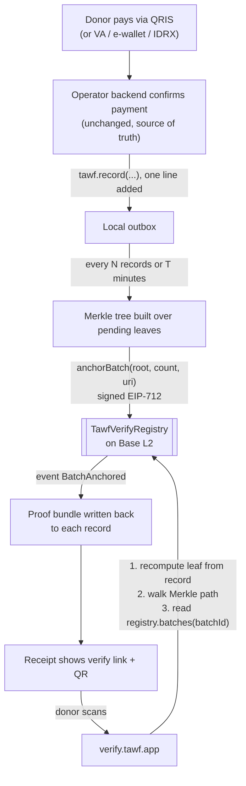
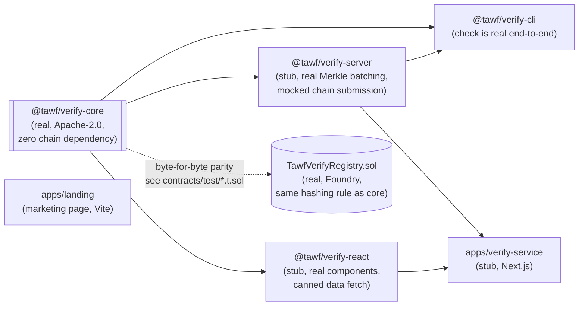

# tawf-verify

> **Note:** The SDK packages (`@tawf/verify-core`, `@tawf/verify-server`, `@tawf/verify-react`, `@tawf/verify-cli`) have moved to [tawf-sdk](https://github.com/tawf-labs/tawf-sdk).

**A notary, not a custodian.**

`tawf-verify` lets a ZISWAF operator (BAZNAS, LAZ, yayasan, masjid) keep collecting donations
the ordinary way - QRIS, bank transfer, virtual account, e-wallet, IDRX - while making every
resulting transaction record independently verifiable on a public blockchain.

The operator's database stays the source of truth for the money. The chain stores only a
`keccak256` fingerprint of each record, batched into a Merkle tree. No token is minted, no
donor funds ever move on chain, and no personal data or unblinded amount reaches the chain by
default. A donor with nothing but a receipt can prove two things without trusting the
operator or Tawf Labs:

1. **Existence** - this record existed at or before block N, timestamp T.
2. **Integrity** - the amount, date, campaign, and recipient are byte-for-byte what was
   recorded then.

Full spec: [`prd.md`](./prd.md).

## Why this is not another "Proof of Coffee"

The reference product this design was torn down against (`poc.bhremada.com`) mints a real
ERC-20 token per order through a custodian vault contract that mints, burns, and transfers
value - a contract bug there can drain funds. `tawf-verify` inverts that on every axis that
matters for a regulated charity flow: the registry contract holds no funds, has no
`payable`/`receive`, and its only state-changing entrypoint is an append-only
`anchorBatch()`. A contract bug here can at worst stop new anchors; it can never touch a
rupiah. See `prd.md` Section 2 for the full teardown.

## How anchoring and verification work



Steps 1 and 2 above run entirely offline, in `@tawf/verify-core`, with no chain dependency.
Step 3 is the only network call, and it is a free, unauthenticated `eth_call`, see
[`prd.md`](./prd.md) Section 7.1 and Appendix B for the full spec this diagram mirrors.

## Repository layout

```
contracts/            TawfVerifyRegistry.sol - Foundry project, no funds, append-only
packages/
  verify-core/         @tawf/verify-core   - canonicalization, Merkle tree, proof verify (real, Apache-2.0)
  verify-server/       @tawf/verify-server - record buffering, batch scheduling, anchor submission (stub)
  verify-react/        @tawf/verify-react  - VerifyBadge / VerifyPanel / TransparencyBoard (stub)
  cli/                 @tawf/verify-cli, bin `tawf-verify` - `check` is real, rest are stubs
apps/
  verify-service/      hosted relayer + public verify page (stub, Next.js)
  landing/             marketing page, Tawf Islamic Foundation design system (Vite + React)
```



`apps/landing` has no dependency on `@tawf/verify-core` or any other package here; it is
content-only, sourced from `prd.md`, styled to match
[`tawf-foundation`](https://tawf.foundation)'s design system exactly (see that app's own
README for the token provenance).

**Status.** Early-stage / active development, matching Phase 0 of `prd.md` Section 13:
`@tawf/verify-core` and `TawfVerifyRegistry.sol` are real and tested. Everything else is a
structured stub - correct interfaces, mocked internals - until Phase 1/2/3 fund them out.
Do not use in production without review.

## Quickstart

```bash
pnpm install
pnpm build
pnpm test        # includes @tawf/verify-core's golden vector suite
pnpm sanity       # scripts/sanity-check.ts - build a tree, prove it, verify it, corrupt it
```

```bash
cd contracts
forge install
forge test -vvv
```

## End-to-end demo (real chain, nothing mocked)

```bash
pnpm demo:e2e
```

[`scripts/e2e-demo.sh`](./scripts/e2e-demo.sh) starts a local `anvil` chain, deploys
`TawfVerifyRegistry.sol` to it with a real broadcast transaction, registers an org and
authorizes a signer, builds a real 3-record Merkle batch with `@tawf/verify-core`, anchors it
with a real `anchorBatch()` transaction, then runs the actual `tawf-verify check` CLI against
that live chain over its RPC endpoint. It prints `VERIFIED - anchored on chain at <real
timestamp>` for the genuine proof and correctly rejects a tampered copy. Every step is a real
transaction or a real `eth_call` against real (locally deployed) bytecode - there is no mock
anywhere in this path, unlike the rest of the stub packages described below.

## The one invariant that matters most

`@tawf/verify-core` must produce a byte-identical leaf hash for identical input on every
platform, forever - this is what lets a proof outlive Tawf Labs (goal G3 in `prd.md`). See
[`CONTRIBUTING.md`](./CONTRIBUTING.md) before touching `canonicalize.ts`, `hash.ts`, or
`merkle.ts`.

## License

Apache-2.0. See [`LICENSE`](./LICENSE).

## Tawf Labs

Building trust-first Islamic-finance infrastructure. This repo publishes hashes, not assets.
